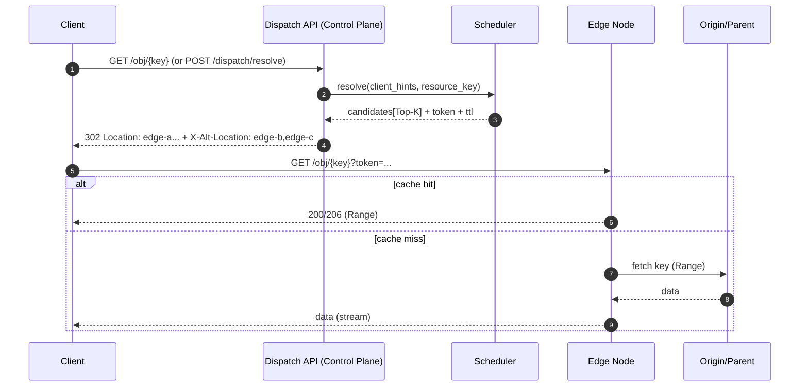

# 架构设计：控制面 + 边缘节点 + 入口适配（默认 302 调度）

> 本文档描述项目的目标架构与模块边界，便于后续实现与扩展（DNS / 网关反代 / Anycast PoP 等）。

## 1. 设计目标

1. **默认可用**：以 302 调度快速落地下载/点播分发（HTTP 对象）。
2. **可扩展**：入口适配、调度策略、鉴权、缓存、存储均可插件化。
3. **混合节点**：兼容云/机房（公网可入站）与家宽 NAT（入站受限）共存。
4. **可观测与可治理**：从 Day1 支持指标/日志/事件；具备隔离与降级机制。

## 2. 分层架构概览

```mermaid
flowchart TB
  subgraph Ingress[入口层（可插拔）]
    R302[302 Adapter\n(默认)]
    DNS[DNS/GSLB Adapter\n(Roadmap)]
    GW[Gateway Proxy Adapter\n(Roadmap)]
  end

  subgraph CP[控制面（Control Plane）]
    API[API Gateway\nHTTP/gRPC]
    REG[Node Registry & Auth]
    HB[Heartbeat & Metrics]
    PROBE[Reachability Probe\n多探测点]
    IDX[Content Index\n对象/分片位置]
    SCH[Scheduler\nTop-K 输出]
    POL[Policy Engine\nACL/成本/限流]
    ABU[Anti-abuse\n风控/隔离]
  end

  subgraph DP[数据面（Data Plane）]
    EDGE[Edge Agent\nHTTP Cache/Proxy]
    FETCH[Fetcher\nOrigin/Parent]
    REP[Reporter\n心跳/指标/摘要]
    TUN[Tunnel Client\n(可选)]
  end

  U[User/Client] --> R302
  R302 --> API
  API --> SCH
  SCH --> R302
  U -->|redirect| EDGE
  EDGE --> FETCH
  FETCH --> ORI[Origin/Parent]
  EDGE <--> REP
  REP --> HB
  REG <--> EDGE
  PROBE --> EDGE
  EDGE --> IDX
  POL --> SCH
  ABU --> SCH
```

## 3. 核心数据流（默认 302）

### 3.1 调度时序



### 3.2 失败切换（Top-K）
- 客户端收到多个候选节点（Top-K，建议 3~5）。
- 若主候选失败（连接失败/5xx/超时），客户端按顺序或权重切换到下一个候选。
- 大文件下载必须支持 Range 断点续传，才能让“切节点”不浪费已传输数据。

## 4. 节点分级（适配云/机房 + 家宽 NAT）

### 4.1 节点类型
- **Public Edge / Parent（公网可入站）**：优先作为被调度服务节点；也可作为父节点汇聚回源。
- **NAT Leaf（入站不可达）**：默认不直接承接公网用户请求；可作为（Roadmap）：
  - 同网/同局域网可达的服务节点
  - 通过网关反代或反向隧道间接提供服务

### 4.2 可达性验证（必须）
控制面需要“多探测点”验证节点真实可达性：
- TCP connect / HTTPS GET 探测
- 记录成功率、RTT、抖动、跨运营商差异
- 输出 `reachable_score` 作为调度硬门槛/强权重

## 5. 调度器（Scheduler）设计

### 5.1 输入信号（建议）
- 用户侧：`client_ip`、`region`、`isp/asn`、可选 `rtt_samples`
- 节点侧：在线/可达性评分、带宽余量、连接数、错误率
- 内容侧：是否命中（对象/分片存在）、命中率、回源成本
- 策略侧：黑白名单、成本、限流、风险

### 5.2 输出约定
调度输出应稳定为：
- `candidates[]`（Top-K）
- `ttl_ms`（候选有效期，避免长时间粘住坏节点）
- `token`（防盗链/防滥用）
- `client_hints`（重试建议、并发建议）

### 5.3 评分模型（示意）
`score = w1*proximity + w2*health + w3*spare_capacity + w4*content_hit - w5*cost - w6*risk`

> 插件化点：不同业务（下载/直播/代理）可以加载不同策略插件。

## 6. 边缘节点（Edge Agent）设计

### 6.1 MVP 必备能力
- HTTP(S) 服务（建议优先支持 HTTP/1.1 + Range）
- 磁盘缓存（LRU/LFU 淘汰）
- 回源（Origin/Parent），支持 Range 回源与并发
- 校验（ETag/Content-Length；Roadmap：分片 hash）
- 上报：心跳、指标、缓存摘要

### 6.2 Roadmap 能力（按需）
- 分片/manifest（并发下载）
- HTTP/3/QUIC
- 网关反代模式与反向隧道

## 7. 安全模型（最小可用）

### 7.1 调度 token（建议 HMAC）
token 建议绑定：
- `resource_key`
- `exp`（短有效期 1~5 分钟）
- 可选：`client_ip_prefix`（降低盗链，但注意移动网络/代理）
- 可选：`max_rate`、`max_conn`

### 7.2 节点信任与隔离
- 节点注册时签发身份（mTLS/证书或长 token）
- 异常节点（失败率高/刷量/探测不可达）进入 quarantine：
  - 暂停调度
  - 降权
  - 需人工/自动恢复

## 8. 可观测性

### 8.1 指标（建议）
- 调度：QPS、命中率（命中优先策略）、候选返回分布
- 边缘：吞吐、5xx、连接失败、缓存命中、回源耗时
- 探活：可达性成功率、RTT 分布

### 8.2 事件
- 节点上线/下线/隔离/恢复
- 策略变更审计
- 调度降级触发（例如“无可达节点 -> 回源兜底”）

